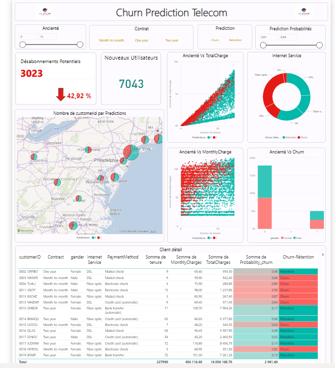

# Dashboard Power BI avec Prédiction de Churn 📊🔍

Bienvenue dans le dépôt de mon projet **Dashboard Power BI avec Prédiction de Churn**. Ce projet intègre Power BI avec un algorithme de Machine Learning pour prédire l'attrition des clients (churn). L'objectif est d'exploiter les données  pour anticiper les comportements des clients et optimiser les stratégies de fidélisation.

## 🚀 Fonctionnalités

- **Visualisation Interactive des Données de Churn**  
  Visualisez les données d'attrition de manière interactive et dynamique à travers divers graphiques et tableaux de bord.

- **Prédictions Précises grâce au Machine Learning**  
  Utilisez des algorithmes avancés de Machine Learning pour obtenir des prévisions précises sur les comportements futurs des clients.

## 📊 Aperçu

  <!-- Remplacez ce lien par une capture d'écran réelle du dashboard -->

## 🛠️ Prérequis

- **Power BI Desktop**  
  Téléchargez et installez [Power BI Desktop](https://powerbi.microsoft.com/desktop/).

- **Environnement de Machine Learning**  
  Assurez-vous d'avoir un environnement Python avec les bibliothèques nécessaires telles que Scikit-learn et Pandas.

## 🚀 Installation

1. **Clonez le Dépôt**
   ```bash
   git clone https://github.com/votre-nom-utilisateur/votre-repository.git
